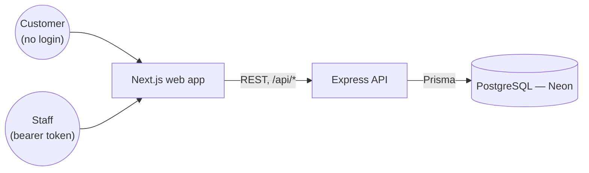
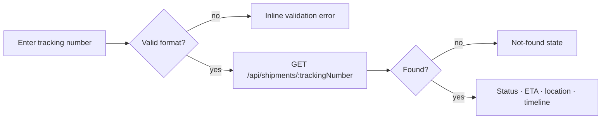
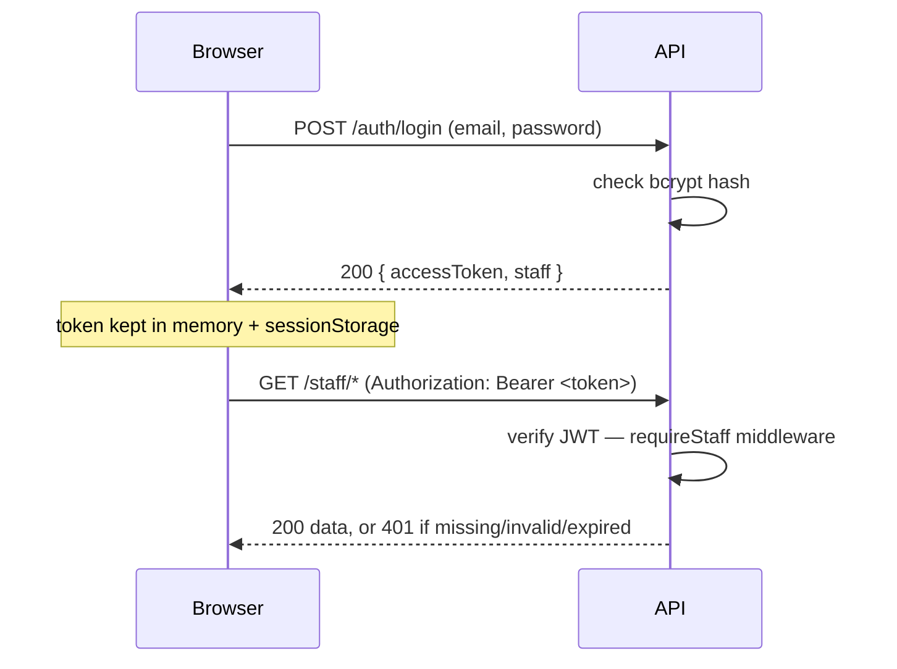
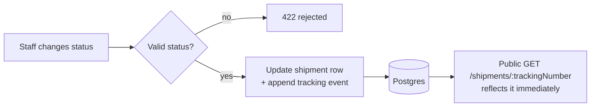
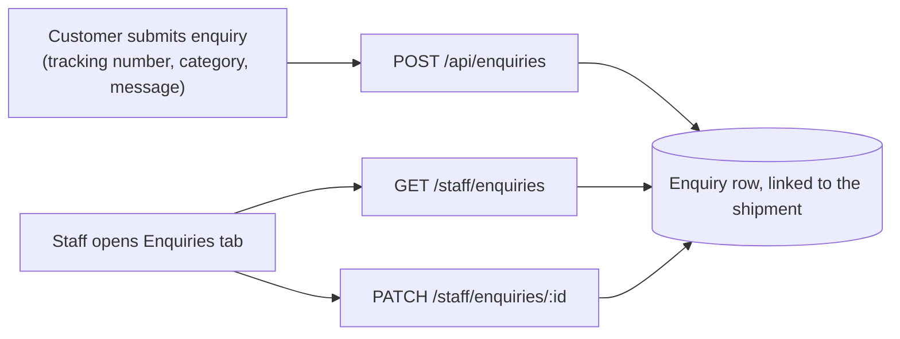
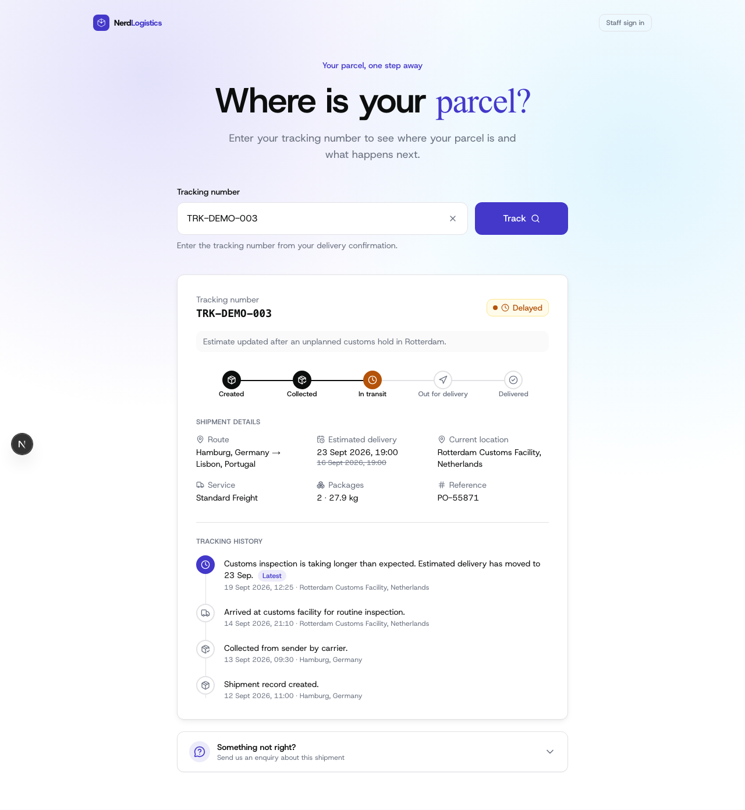
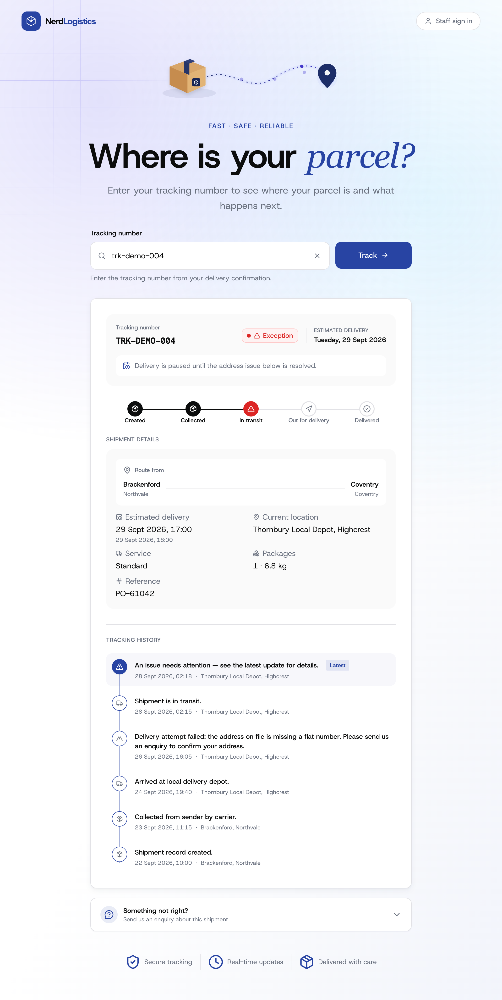
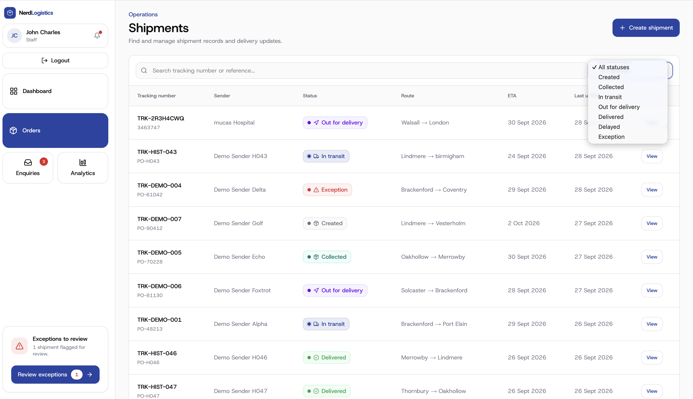
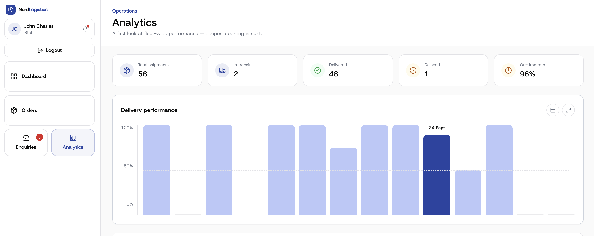

# NerdLogistics — Shipment Tracking Dashboard

A logistics web app with two experiences: a public page where anyone can track a shipment, and a staff dashboard (behind login) for managing shipments, statuses, tracking history and customer enquiries. Built for the *Shipment Tracking Dashboard* take-home task

## Live deployment

| | |
|---|---|
| Live URL | **https://nerd-project-web.vercel.app/** |
| Staff sign-in | https://nerd-project-web.vercel.app/staff |
| Demo staff login | `staff@shiptrack.com` / `demo1234` |
| Demo tracking numbers | see [Demo data](#demo-data) below |


The customer tracking page needs no login. The staff area sits behind the credentials above — a private/incognito window reproduces exactly what a reviewer would see.

## What I built

**Customer** — enter a tracking number, get a plain-language status, origin/destination, current location, estimated delivery and a chronological timeline with the latest event marked. Empty input, an unknown tracking number, and a genuine server error are three different, deliberately designed states — never a raw error message. A collapsible form lets the customer raise an enquiry against the shipment they just looked up.

**Staff** — log in, see fleet-wide counts and a delivery-performance chart on the dashboard, search/filter/paginate the shipment list, open a shipment to edit it, change its status, append a tracking event or an internal note, create new shipments, and review/resolve customer enquiries.

## Architecture



One frontend, one API, one database — the frontend never talks to the database directly, and every piece of state a screen shows came from a real request.

| Layer | Choice | Why |
|---|---|---|
| Frontend | Next.js 16 (App Router) + React 19 | Server components keep the public page free of client JS; file-based routing keeps the staff area organised. |
| Data layer | Axios + TanStack Query v5 | One hook per operation owns its own loading/error/cache state — no hand-rolled `useEffect` fetching. |
| Styling | Tailwind CSS v4 | Utility-first, with a small design-token layer shared by both the customer and staff UI. |
| Backend | Express 5 + TypeScript | A small, explicit REST API — resource-oriented routes, Joi validation middleware, a thin service layer per module. |
| Database | PostgreSQL (Neon) via Prisma 6 | Genuinely persistent, typed queries, versioned migrations — not an in-memory array. |
| Auth | Signed JWT as a bearer token | Sent as `Authorization: Bearer <token>`, verified server-side on every staff route by `requireStaff` middleware. |
| Testing | Vitest, Supertest (server) + React Testing Library (web) | Supertest drives the real Express app against a real ephemeral Postgres instance — not a mocked database. |

### Folder structure

```
nerdProject/
├── web/                        Next.js app — customer + staff UI
│   ├── src/app/                   routes: / , /staff, /staff/dashboard, /staff/shipments, /staff/enquiries, /staff/analytics
│   ├── src/api/                   axios client + interceptors, one module per domain (auth, shipments, enquiries, staff), token store
│   ├── src/hooks/                 TanStack Query hooks, one file per domain
│   └── src/components/            UI, split into customer/ staff/ ui/
├── server/                     Express API
│   ├── src/modules/               one folder per resource: auth, shipments, enquiries, dashboard, analytics
│   ├── src/middleware/            requireStaff (auth), validate (Joi), rate limiters, error handler
│   ├── prisma/                    schema.prisma + versioned migrations
│   └── src/seed/                  demo data (idempotent, re-runnable)

```

Full detail on each side: [`web/README.md`](web/README.md) (Frontend/UX/performance/testing) and [`server/README.md`](server/README.md) (API reference, Backend, data model, deployment).

## How the core flows work

**Customer tracking**



No account, one request. A 404 is a normal product state, not an error screen.

**Staff authentication**



The token, not a cookie — it survives a page refresh (mirrored to `sessionStorage`) but never touches `localStorage`, and it's rejected server-side regardless of what the frontend does or doesn't hide.

**Shipment / status update**



Status and timeline are written together, in one transaction — there's no separate "status" field that could disagree with the event history.

**Customer enquiry**



Same database row on both sides — an enquiry a customer submits shows up, unmodified, in the staff queue.

## Screenshots

| Customer landing | Customer tracking result | Customer tracking — exception |
|---|---|---|
|  |  |  |

| Staff dashboard | Staff shipment list | Staff analytics |
|---|---|---|
|  |  |  |

## Running it locally

**Prerequisites:** Node.js ≥ 20.9, npm, and a Postgres database (a free [Neon](https://neon.tech) project is the easiest match for production; any local Postgres also works).

```bash
git clone https://github.com/Pcharlesme/nerdProject.git
cd nerdProject
npm install                          # installs both workspaces
cp server/.env.example server/.env   # fill in DATABASE_URL, DIRECT_URL, JWT_SECRET
npm run db:setup --workspace=server  # migrate + seed
npm run dev                          # web on :3000, API on :4000
```

Open `http://localhost:3000` for the customer page, `http://localhost:3000/staff` for staff sign-in.

### Environment variables

**`server/.env`** — copy from [`server/.env.example`](server/.env.example):

| Variable | Required | Purpose |
|---|---|---|
| `DATABASE_URL` | Yes | Pooled Postgres connection string, used at runtime. |
| `DIRECT_URL` | Yes | Direct (non-pooled) connection string — needed by `prisma migrate`. |
| `JWT_SECRET` | Yes | Signs the staff access token. ≥ 32 chars — `openssl rand -base64 48`. |
| `NODE_ENV` | No | `production` disables verbose error detail. |
| `CORS_ORIGIN` | No | Origins allowed to call the API (default `http://localhost:3000`). |
| `SEED_STAFF_EMAIL` / `SEED_STAFF_PASSWORD` | No | Overrides the demo account `npm run db:seed` creates. |

`web/.env.local` is optional for local dev — see [`web/.env.example`](web/.env.example); it only matters if the frontend and API are ever hosted on separate origins.

### Database setup, migrations, seeding

```bash
npm run db:migrate --workspace=server   # applies committed migrations
npm run db:seed --workspace=server      # truncates + re-seeds demo data (safe to re-run)
npm run db:setup --workspace=server     # both, in order
```

## Demo data

| Tracking number | Status | What it shows |
|---|---|---|
| `TRK-DEMO-001` | In transit | Normal shipment, several timeline events |
| `TRK-DEMO-002` | Delivered | Full history ending in a delivered event |
| `TRK-DEMO-003` | Delayed | Updated ETA + explanatory event, plus an open enquiry |
| `TRK-DEMO-004` | Exception | Clear issue message, plus an open enquiry |
| `TRK-DEMO-005` | Collected | Only one or two events — a shipment that just started |
| `TRK-DEMO-006` | Out for delivery | Mid-journey, four events |
| `TRK-DEMO-007` | Created | No events yet — the timeline's empty state |

Plus ~45 randomised historical shipments (`TRK-HIST-*`) so search/filters/pagination have real volume, and 5 fictional enquiries across all categories and both `OPEN`/`RESOLVED` states. Every name, email and message in the seed data is fictional.

## Testing

```bash
npm test              # both workspaces (81 tests)
npm run test:server   # 47 tests — Supertest, real ephemeral Postgres
npm run test:web      # 34 tests — Vitest + React Testing Library, API mocked at the network boundary
```

```
Test Files  7 passed (7)
     Tests  47 passed (47)   # server
Test Files  11 passed (11)
     Tests  34 passed (34)   # web
Total Test  of (81/81) passed
```

Covers: public tracking (found / not-found / validation), staff auth (wrong password, missing/expired/forged token, every `/staff/*` route rejecting an unauthenticated request), shipment creation/validation/duplicate-tracking-number rejection, status changes and event ordering, enquiry creation and resolution, rate limiting, and the frontend's query hooks + component flows (`EnquiryPanel`, `UpdateStatusPanel`, `TrackingLanding`, `StaffAuthProvider`).

## API overview

REST, JSON, resource-oriented. Full reference: [`server/README.md`](server/README.md).

```
Public   GET  /api/shipments/:trackingNumber     Track a shipment (no contacts/notes)
         POST /api/enquiries                       Submit a customer enquiry

Auth     POST /api/auth/login    POST /api/auth/logout    GET /api/auth/me

Staff    GET   /api/staff/dashboard                  Status counts + recent activity
         GET   /api/staff/shipments                   List, search, filter, paginate
         GET   /api/staff/shipments/:trackingNumber   Full record (contacts, notes)
         POST  /api/staff/shipments                    Create
         PATCH /api/staff/shipments/:trackingNumber          Edit
         PATCH /api/staff/shipments/:trackingNumber/status   Change status (writes a matching event)
         POST  /api/staff/shipments/:trackingNumber/events   Append a tracking event
         POST  /api/staff/shipments/:trackingNumber/notes    Add an internal note
         GET   /api/staff/enquiries      PATCH /api/staff/enquiries/:id
         GET   /api/staff/analytics/delivery-performance
```

Every `/api/staff/*` route (and `/api/auth/me`) requires a valid bearer token, checked server-side — a hidden frontend route was never the actual boundary. Every mutating endpoint validates its body with Joi, independent of the frontend. Errors are always `{ error: { code, message, details? } }`, and unexpected failures return a generic 500 with no stack trace.

## Assumptions and product decisions

- **A status change *is* a tracking event** — changing status writes a timeline event with that status attached, so the staff badge and the customer timeline can't disagree.
- **Only the newest event moves `status`/`currentLocation`** — back-filling an older event never rewinds what the customer currently sees.
- **The public API is an allow-list**, not a filtered staff response — contact details and internal notes are never serialized onto it at all.
- **One staff role, no refresh tokens** — the brief scopes out complex roles; a fixed-expiry JWT is enough to demonstrate real, server-enforced auth without over-building.
- **Tracking numbers can be typed or auto-generated** — a duplicate is rejected with a specific 409 either way.
- **The delivery-performance chart is a fixed 14-day window** — a real "any date range" picker wasn't required to make the chart genuinely data-driven rather than mocked.
- **Shipment/staff lists are server-paginated**, not held entirely in the browser.

## Known limitations and what I'd improve next

- No shipment location map — text-based current location only (explicitly optional in the brief).
- staff audit trail of who changed what and when

- Single Render service, free tier — a real deployment would want an always-on API process and a paid Postgres tier.

## Checklist — task requirements

| Task requirement | Where to see it |
|---|---|
| Public tracking: status, origin/destination, ETA, current location, timeline | `/`, any `TRK-DEMO-*` number — see [screenshots](#screenshots) |
| Delivered / delayed / exception / in-transit states, each visually distinct | `TRK-DEMO-002/003/004/001` |
| Not-found and validation handled as product states, not errors | Search an unknown or malformed number on `/` |
| Customer enquiry, no account needed | Enquiry form on any tracking result page → `POST /api/enquiries` |
| Staff login, seeded demo account | `/staff` → credentials in [Live deployment](#live-deployment) |
| Passwords hashed, never exposed | `bcryptjs`, 12 rounds — `server/src/modules/auth/auth.service.ts` |
| Staff routes protected server-side, not just hidden in the UI | `requireStaff` middleware, mounted at the router level — `server/src/app.ts` |
| Invalid credentials / expired / missing session handled cleanly | `server/src/tests/auth.test.ts`; 401 → central redirect in `web/src/api/client.ts` |
| Create / edit shipment, change status, add event, add internal note | `/staff/shipments/new`, any shipment detail page |
| Shipment list: search, filter by status, pagination | `/staff/shipments` |
| Staff enquiry view, mark open/resolved | `/staff/enquiries` |
| Server-side validation on every mutating endpoint | Joi schemas — `server/src/modules/*/*.schemas.ts` |
| Coherent REST API, predictable errors | [API overview](#api-overview) |
| Public vs. staff data genuinely separated | `toPublicShipment()` allow-list — `server/src/modules/shipments/shipment.serializers.ts` |
| Persistent database, repeatable seed | Postgres/Neon + Prisma migrations; `npm run db:seed` |
| Responsive, accessible UI (loading/empty/error states, no colour-only status) | Every list/detail screen — status uses icon + label + colour |
| Automated tests: backend behaviour, auth/validation, frontend flow | [Testing](#testing) — 81 tests across both workspaces |
| Live URL, README, walkthrough | [Live deployment](#live-deployment), this file, `WALKTHROUGH_SCRIPT.md` |
| Secrets in env vars, nothing committed | `server/.env` gitignored; `.env.example` has placeholders only |

## Submission

1. **Repository:** this repo
2. **Live app URL:** https://nerd-project-web.vercel.app/
3. **Live app URL:** https://nerd-project-web.vercel.app/
4. **Demo credentials:** `staff@shiptrack.com` / `demo1234`
5. **Walkthrough:** 


