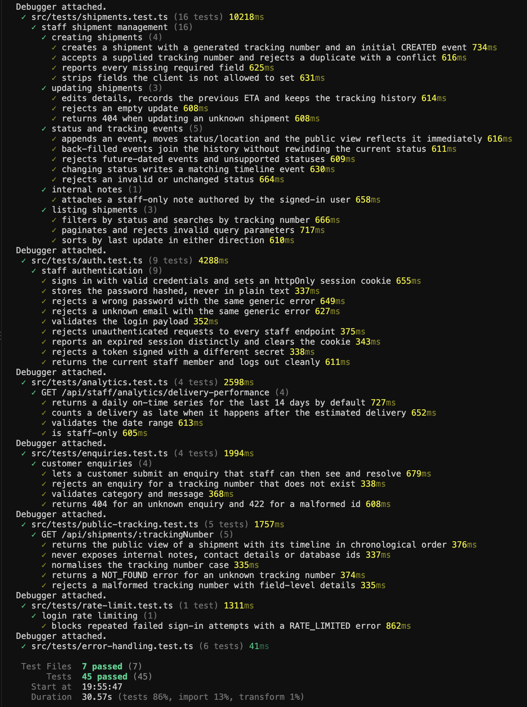

# NerdLogistics — Shipment Tracking Dashboard

A logistics web app with two experiences: a public page where anyone can track a shipment, and a protected staff dashboard for managing shipments, statuses, tracking history and customer enquiries. Built for a one-week take-home task — see [`requirement/Software Developer Task.pdf`](requirement/Software%20Developer%20Task.pdf) for the original brief.

```
Customer → Track shipment → Understand status → View journey → Submit enquiry
Staff    → Log in → Dashboard → Find/manage shipments → Update status/events/notes → Resolve enquiries
```

## Live deployment

| | |
|---|---|
| **Live URL** (customer + staff — one combined service) | **https://nerdlogic.onrender.com** |
| Staff sign-in | https://nerdlogic.onrender.com/staff |
| Demo staff login | `staff@shiptrack.com` / `demo1234` |
| Demo tracking numbers | see the table below |
| Walkthrough video | _add the recording link here before submitting_ |

> **Before submitting:** a deployment-config bug (Express answering all public traffic instead of Next.js) was found and fixed in this review pass — see [`server/README.md` §9](server/README.md#9-deployment-render--neon--why-aws-shows-up). Push this fix and confirm `/` and `/staff` load correctly on the live URL (not just `/api/*`) before treating the link above as verified.

The customer tracking page requires no login. The staff area is behind the demo credentials above — sessions are httpOnly cookies, so opening the live URL in a private/incognito window and logging in as above reproduces exactly what a reviewer would see.

### Demo tracking numbers

| Tracking number | Status | Route | What it demonstrates |
|---|---|---|---|
| `TRK-DEMO-001` | In transit | Brackenford → Port Elsin | Normal shipment with several timeline events |
| `TRK-DEMO-002` | Delivered | Oakhollow → Lindmere | Full history ending in a delivered event |
| `TRK-DEMO-003` | Delayed | Vesterholm → Solcaster | Updated ETA + an explanatory delay event, plus an open enquiry |
| `TRK-DEMO-004` | Exception | Brackenford → Thornbury | A clear issue message on the latest event, plus an open enquiry |
| `TRK-DEMO-005` | Collected | Oakhollow → Merrowby | New shipment with only one or two events |
| `TRK-DEMO-006` | Out for delivery | Solcaster → Brackenford | Mid-journey status, four events |
| `TRK-DEMO-007` | Created | Lindmere → Vesterholm | Brand-new record — timeline's empty state |

The seed also generates ~48 additional randomised historical shipments (`TRK-HIST-*`) so the staff list, search, filters and pagination have enough volume to be meaningful, plus 5 seeded customer enquiries (2 open, 3 resolved) linked to real tracking numbers above. Every name, email, phone number and message in the seed data is fictional (emails use the reserved `.test`/`example.com` domains; phone numbers are placeholder patterns) — see the [mock-data rule](requirement/Software%20Developer%20Task.pdf).

## What I built

**Customer** (public, no account): enter a tracking number → see plain-language status, origin/destination, current location, a bold estimated-delivery date, service/package/reference details, and a chronological timeline with the latest event clearly marked. Handles empty input, malformed input, "not found", and genuine network/server errors as distinct states — never a raw error. A collapsible form lets the customer raise an enquiry against the tracking number they just looked up.

**Staff** (behind login): sign in with the seeded account → dashboard with fleet-wide status counts and a delivery-performance chart → search/filter/paginate the full shipment list → open a shipment to edit its details, change its status (which writes a matching timeline event automatically), append a custom tracking event, or add an internal note (staff-only, visually and semantically separate from the public timeline) → create new shipments → review and resolve customer enquiries → a dedicated analytics view.

## Tech stack and why

| Layer | Choice | Why |
|---|---|---|
| Frontend framework | Next.js 16 (App Router) + React 19 | One deploy artifact serves both the public and staff routes; server components keep the static customer landing page free of unnecessary client JS, and file-based routing keeps the staff area's many screens organised without extra tooling. |
| Frontend data layer | Axios + TanStack Query v5 | A hook per operation (`useStaffShipments`, `useUpdateShipment`, …) owns that operation's loading/error/cache/invalidation — every screen gets consistent request states for free instead of hand-rolled `useEffect`/`useState` fetch logic repeated per component. |
| Styling | Tailwind CSS v4 | Utility-first with a small CSS-variable design-token layer (`web/src/styles/tokens.css`) — one shared colour/spacing system for both the calm customer UI and the denser staff UI, no separate component-library dependency. |
| Backend | Express 5 + TypeScript | A small, explicit REST API is easier to reason about and test than a bigger framework for this scope — resource-oriented routes, Joi validation middleware, and a thin service layer per module (`server/src/modules/*`). |
| Database | PostgreSQL (hosted on [Neon](https://neon.tech)) via Prisma 6 | A genuinely persistent relational database (not SQLite-in-a-container that resets on redeploy), with Prisma's migrations and typed client giving compile-time safety on every query. Neon's free tier is enough for this scope and needs no server to manage. |
| Auth | Signed JWT in an httpOnly cookie | Same-origin cookie auth avoids ever putting a token in browser-accessible storage; `requireStaff` middleware verifies it server-side on every staff route, so a hidden frontend route is never mistaken for real protection. |
| Testing | Vitest everywhere; Supertest (server) + React Testing Library (web) | One test runner across both workspaces; Supertest drives the real Express app against a real (ephemeral) Postgres instance rather than mocking the database, and RTL renders real components against a mocked API boundary rather than testing implementation details. |

## Architecture

```
Browser
  │
  ├─ GET /                      → Next.js server component (static customer landing page)
  ├─ GET /staff/*                → Next.js client components, behind session cookie
  └─ fetch /api/*                → same-origin, proxied by Next's rewrite (web/next.config.ts)
                                        │
                                        ▼
                                 Express API (server/), port 4000, loopback-only in production
                                        │
                                        ▼
                                 PostgreSQL (Neon), via Prisma
```

One Render web service (see [`render.yaml`](render.yaml)) runs both processes side by side: Next.js listens on the public `$PORT` Render assigns, and the Express API listens on a fixed loopback-only port. Next's own rewrite (`/api/:path*`) proxies browser requests to the API process, so the browser only ever talks to one origin — which is also why the staff session cookie works without any CORS configuration in production. Full detail: [`server/README.md` §9](server/README.md#9-deployment-render--neon--why-aws-shows-up).

### Repository structure

```
├── web/          Next.js frontend — customer tracking page + staff dashboard
│   └── README.md   Frontend architecture, UX decisions, performance notes, testing
├── server/       Express + Prisma + PostgreSQL API
│   └── README.md   Full API reference, data model, security, deployment
└── requirement/  The task brief, this project's own review checklists, and the
                  endpoint↔hook↔consumer integration map
```

This is an npm workspace monorepo (`web`, `server`) — a single `npm install` at the root installs both.

## Local setup

**Prerequisites:** Node.js ≥ 20.9 (repo tested on Node 22), npm, and a PostgreSQL database — either a free [Neon](https://neon.tech) project (recommended, matches production) or any local Postgres instance.

```bash
git clone <this-repo-url>
cd nerdProject
npm install                          # installs both workspaces from the root
cp server/.env.example server/.env   # fill in DATABASE_URL, DIRECT_URL, JWT_SECRET (see below)
npm run db:setup --workspace=server  # runs migrations, then seeds demo data
npm run dev                          # web on :3000, API on :4000, concurrently
```

Open http://localhost:3000 for the customer page, or http://localhost:3000/staff to sign in with the demo credentials above.

### Environment variables

**`server/.env`** (copy from [`server/.env.example`](server/.env.example) — required values are unset there, everything else has a sensible default):

| Variable | Required | Purpose |
|---|---|---|
| `DATABASE_URL` | Yes | Postgres connection string used at runtime (pooled, if your provider distinguishes pooled/direct). |
| `DIRECT_URL` | Yes | Direct (non-pooled) connection string, used only by `prisma migrate`. |
| `JWT_SECRET` | Yes | Signs the staff session cookie. Must be ≥ 32 characters — generate one with `openssl rand -base64 48`. |
| `NODE_ENV` | No (default `development`) | `production` tightens cookie flags and disables verbose error detail. |
| `PORT` | No (default `4000`) | API port. |
| `CORS_ORIGIN` | No (default `http://localhost:3000`) | Comma-separated list of origins allowed to call the API directly (relevant if the frontend is ever deployed separately from the API — see `web/src/api/client.ts`). |
| `SEED_STAFF_EMAIL` / `SEED_STAFF_PASSWORD` | No (default the demo credentials above) | The account `npm run db:seed` creates. |
| `JWT_EXPIRES_IN_MINUTES`, `TRUST_PROXY`, `*_RATE_LIMIT_MAX` | No | Session lifetime, reverse-proxy trust, and per-route rate limits — all have safe defaults, see the file for details. |

**`web/.env.local`** (copy from [`web/.env.example`](web/.env.example)) — both variables are optional for local dev; the defaults already route the browser's `/api/*` calls through Next's rewrite to `http://127.0.0.1:4000`. `API_ORIGIN` overrides where that rewrite points; `NEXT_PUBLIC_API_BASE_URL` bypasses the rewrite entirely (only needed if the frontend and API are ever hosted on different origins).

### Database setup, migrations and seeding

```bash
npm run db:migrate --workspace=server   # applies committed migrations (prisma migrate deploy)
npm run db:seed --workspace=server      # truncates and re-seeds demo data (idempotent, safe to re-run)
npm run db:setup --workspace=server     # both of the above, in order — what `render.yaml`'s deploy step runs
```

Schema and migrations live in `server/prisma/`; the seed script is `server/src/seed/` (see [`server/README.md` §12](server/README.md#12-demo-data) for exactly what gets created).

## Testing

```bash
npm test              # runs both workspaces' full suites (72 tests total)
npm run test:server   # 45 tests — Supertest against a real, ephemeral Postgres (via embedded-postgres)
npm run test:web      # 27 tests — Vitest + React Testing Library, API layer mocked at the boundary
```

What's covered (not exhaustive — see the test files themselves for the full list): public tracking lookup (found/not-found/validation), staff auth (wrong password, missing/expired session, every `/api/staff/*` route rejecting an unauthenticated request), shipment creation/validation/duplicate-tracking-number rejection, status changes and event ordering, enquiry creation and resolution, rate limiting, and the frontend's TanStack Query hooks (loading → success/error, cache writes, mutation states) plus full component-level flows (`EnquiryPanel`, `UpdateStatusPanel`, `TrackingSearch`, `StaffAuthProvider`).



## API overview

REST, JSON, resource-oriented. Full endpoint-by-endpoint reference (request/response shapes, status codes, validation rules): [`server/README.md`](server/README.md). Frontend hook ↔ endpoint mapping: [`requirement/api-integration.md`](requirement/api-integration.md).

```
Public         GET  /api/shipments/:trackingNumber        Track a shipment (no sender/receiver/notes)
               POST /api/enquiries                          Submit a customer enquiry

Auth           POST /api/auth/login    POST /api/auth/logout    GET /api/auth/me

Staff          GET   /api/staff/dashboard                   Status counts + recent activity
               GET   /api/staff/shipments                    List, search, filter, paginate
               GET   /api/staff/shipments/:trackingNumber    Full record (sender/receiver/notes)
               POST  /api/staff/shipments                    Create
               PATCH /api/staff/shipments/:trackingNumber          Edit (never touches history)
               PATCH /api/staff/shipments/:trackingNumber/status   Change status (writes a matching event)
               POST  /api/staff/shipments/:trackingNumber/events   Append a tracking event
               POST  /api/staff/shipments/:trackingNumber/notes    Add an internal note (staff-only)
               GET   /api/staff/enquiries      PATCH /api/staff/enquiries/:id
               GET   /api/staff/analytics/delivery-performance
```

Every `/api/staff/*` route requires the session cookie and is rejected server-side (401) if it's missing, invalid or expired — enforced by middleware, not by hiding the frontend route. Every mutating endpoint validates its body server-side with Joi, independent of the frontend's own validation. All error responses are a consistent `{ error: { code, message, details? } }` shape, and unexpected failures return a generic 500 without leaking stack traces.

## Assumptions and product decisions

- **A status change is a tracking event, not a separate concept.** Changing a shipment's status writes a timeline event with that status attached, so the badge shown to staff and the timeline shown to the customer are structurally incapable of disagreeing — there's one source of truth (`server/src/modules/shipments/shipment.service.ts`), not two fields kept in sync by hand.
- **Adding an event only moves `status`/`currentLocation`/`updatedAt` if it's the newest event on the timeline.** Back-filling an older, historical event never rewinds what the customer currently sees, and (as of this review pass) never falsely bumps the shipment to the top of a "recently updated" sort either.
- **The public API is an allow-list, not a filtered version of the staff shape.** `toPublicShipment` only ever includes the fields a customer is allowed to see — sender/receiver contact details and internal notes are never serialized onto that response at all, so there's no risk of a future field addition accidentally leaking.
- **One staff role, session-cookie auth, no refresh-token complexity.** The brief explicitly scopes out complex roles; a signed JWT in an httpOnly cookie with a fixed expiry is enough to demonstrate real, server-enforced authentication without over-building.
- **Tracking numbers can be supplied or auto-generated.** Staff can type a custom one when creating a shipment or leave it blank; the server generates a unique one if omitted, and rejects a duplicate with a specific 409 either way.
- **The delivery-performance chart fetches one default window** (the server's own last-14-days default) and the calendar picker only lets you select among dates that window actually returned — it doesn't re-fetch a different range as you navigate the calendar. A real "any month" picker would need the query to follow the calendar; not required to make the chart real rather than mocked.
- **Dashboard/shipment lists are server-paginated**, not held entirely in browser memory — this matters once the seed data (~55 shipments) is larger than a trivial demo dataset would be.
- **The customer landing page is a static, server-rendered page** with one small client-side "island" (the search box + its results) — everything else needed zero client JS to paint, which is why Lighthouse performance moved from ~70 to ~97 during the polish pass (see `web/README.md` §7 for the full before/after).

## Known limitations and what I'd improve next

- **No shipment location map** — text-based current location only (explicitly optional per the brief).
- **No staff audit trail** of who changed what — only the change itself is recorded, not the acting staff member's history of edits (there is exactly one staff account seeded, so this matters less here than it would with multiple staff users).
- **Delivery-performance chart is a fixed 14-day window** (see above) — a real "pick any date range" experience is the natural next step.
- **No CSV export or automated accessibility audit** were added as stretch items — time went to finishing the core flows and the performance/UX pass instead, per the brief's own guidance to prioritise a complete core over a wider feature set.
- **Single Render service, free tier** — acceptable for a review deployment; a real production deployment would want a separate always-on API process and a paid Postgres tier (Neon's free tier suspends after inactivity, so the very first request after a while can be a few seconds slower while it wakes up).

## Submission

- **Repository:** this repo.
- **Live app URL:** https://nerdlogic.onrender.com
- **Demo credentials:** `staff@shiptrack.com` / `demo1234`
- **Walkthrough:** _add the recording link here before submitting_
