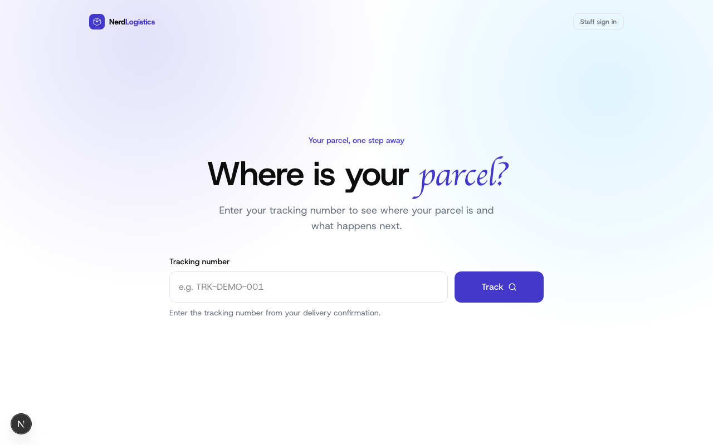
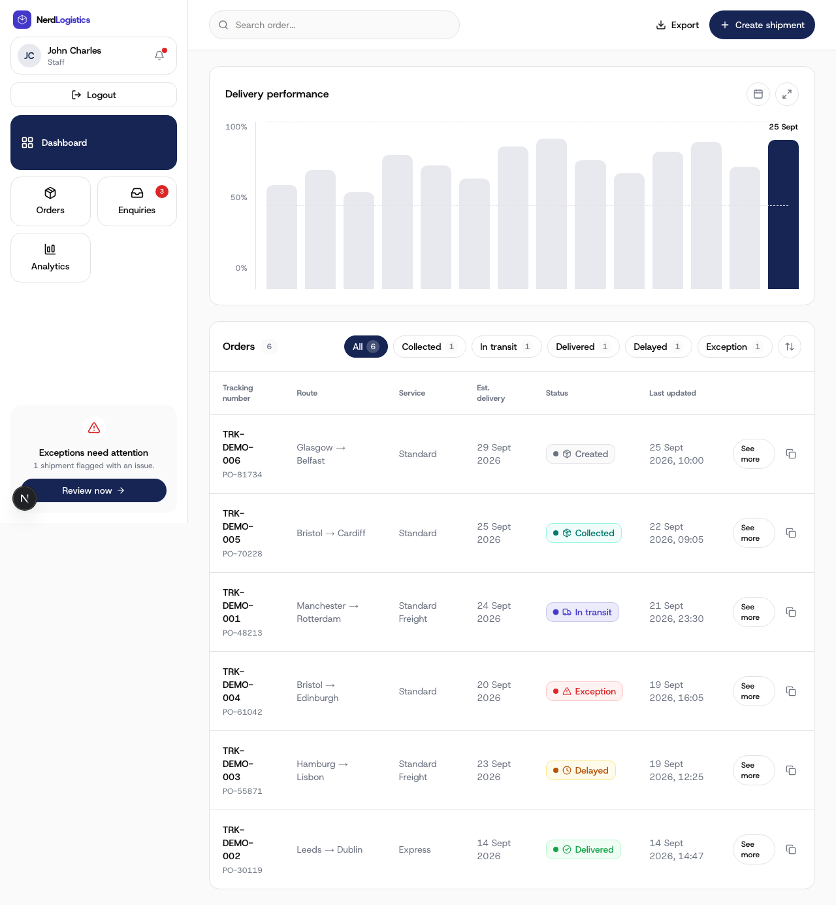

# Nerd Logistics — Shipment Tracking Dashboard

A responsive logistics web app with two experiences: a public page where anyone can track a shipment, and a staff dashboard for managing shipments and customer enquiries.

```
Customer → Track Shipment → Understand Status → View Journey → Submit Enquiry
Staff    → Login → Dashboard → Manage Shipments → Manage Enquiries → Analytics
```



---

## 1. Overview

The customer side answers one question as fast as possible — *where is my parcel?* — without requiring an account: enter a tracking number, get a clear status, a journey timeline, and a way to raise an enquiry if something's wrong.

The staff side is an internal operations tool: sign in, see what needs attention at a glance, find and manage shipments, keep the tracking history honest, and clear the enquiry queue.

## 2. Frontend Architecture

```
src/
├── app/
│   ├── page.tsx                      # Customer tracking (public)
│   ├── not-found.tsx
│   └── staff/                        # Protected — behind StaffAuthProvider
│       ├── page.tsx                  # Login
│       ├── dashboard/
│       ├── shipments/                # list · [trackingNumber] · new
│       ├── enquiries/
│       └── analytics/
├── components/
│   ├── customer/                     # Tracking search, result, enquiry form
│   ├── shipments/                    # Status stepper + timeline (shared by both experiences)
│   ├── staff/                        # Sidebar, CRUD panels, delivery-performance chart
│   └── ui/                           # Button, Logo, StatusBadge, InfoField
├── providers/                        # AppDataProvider (data/service layer), StaffAuthProvider
├── lib/                              # Formatting, status-tone mapping, CSV export
├── constant/                         # Seed data
└── types/                            # Shared TypeScript models
```

The Customer and Staff route trees only ever talk to the app through the **providers** layer — no component reaches into raw data directly. That boundary is what lets `AppDataProvider` be the single place that changes when it starts calling a real API instead of resolving in memory (see [§6](#6-api-integration)).

## 3. Customer Experience

A single search box is the whole entry point. Submitting an empty field or an obviously malformed tracking number is caught before anything is looked up; a valid one shows a loading state and then either the shipment or an explicit "not found" message — never a raw error.

A found shipment shows its status in plain language with a distinct icon and colour (never colour alone), origin/destination, current location, ETA — including a struck-through previous ETA when it's changed — and key details (service, packages, reference). Below that, a chronological timeline shows every event with a timestamp, location and message, the latest one clearly marked, with a proper empty state if the shipment has no events yet.

| State | Treatment |
|---|---|
| In transit | Progress stepper, current location, ETA |
| Delivered | Confirms completion and shows the delivered event/date |
| Delayed | Visible delay flag, explanatory note, updated ETA |
| Exception | Distinct warning colour + plain-language explanation |

A collapsible enquiry form (tracking number, category, message) lets a customer flag a problem without leaving the page. Every screen is responsive down to a single mobile column, with no horizontal scrolling anywhere, including the timeline.

## 4. Staff Experience

| Area | What it does |
|---|---|
| Authentication | Sign in with seeded credentials; explicit identity + sign-out in the sidebar; expired/missing sessions redirect to login with a clear reason |
| Dashboard | Status counts, a delivery-performance chart, and the full order list in one view |
| Shipment list | Search by tracking number, filter by status, responsive table/card view |
| Create shipment | Full intake form with required-field validation and duplicate-tracking-number protection |
| Edit shipment | Update route/ETA/service details without ever touching tracking history |
| Status updates | Move a shipment to a new status — it's recorded as a tracking event, so the badge and the timeline can never disagree |
| Tracking events | Append a custom, customer-visible update to the history (append-only, never overwritten) |
| Internal notes | Staff-only notes, visually distinct from the public timeline so the two are never confused |
| Enquiries | Review, resolve and reopen customer enquiries, linked back to their shipment |
| Analytics | Delivery-performance trend with a real date picker, plus a fleet-wide status breakdown |

The sidebar (Dashboard / Orders / Enquiries / Analytics) is fixed to the viewport and never scrolls on its own, on any screen size — the page content scrolls past it.



## 5. UX & Design

- A calm, customer-first tracking experience; a denser, operations-focused staff interface — deliberately different registers for two different audiences.
- One consistent colour system: the brand indigo for the customer site, a dedicated navy for every staff action, and a distinct colour per shipment status (no two ever share a colour, and none relies on colour alone — every status also has its own icon and label).
- Loading, empty, error and success states are treated as first-class UI, not an afterthought — search, forms, and every staff action all have one.
- Semantic HTML, labelled form controls, visible focus states and keyboard-operable controls throughout.
- Consistent spacing, typography and iconography (Lucide) across both experiences.
- Motion is restrained and functional — entrance transitions, a collapsible panel, a calendar popover — never decorative for its own sake.

## 6. API Integration

```
User
 ↓
Frontend UI  (customer + staff routes)
 ↓
Service layer  (AppDataProvider / StaffAuthProvider)
 ↓
Backend
```

The frontend never talks to data directly — every read and write (`lookupShipment`, `createShipment`, `updateShipment`, `addTrackingEvent`, `addInternalNote`, `submitEnquiry`, `setEnquiryStatus`, `login`) goes through this service layer, shaped exactly like the calls a real API would expose. That contract — every route, payload and validation rule — is written out in full in [`../requirement/backend-integration-notes.md`](../requirement/backend-integration-notes.md), which is intentionally kept as a separate document so this README stays a frontend README.

## 7. Testing

Automated tests use **Vitest** + **React Testing Library**, covering the three areas the task calls out:

| Test | Covers |
|---|---|
| `providers/__tests__/AppDataProvider.test.tsx` | Shipment lookup, and rejecting a duplicate tracking number on creation — the app's core data-layer behaviour |
| `providers/__tests__/StaffAuthProvider.test.tsx` | Login rejects incorrect credentials; accepts the seeded demo account; logout clears the session |
| `components/customer/__tests__/TrackingSearch.test.tsx` | Empty/invalid submissions are blocked with an inline error; a valid tracking number calls through; the loading state disables the control |

```bash
npm test          # run once
npm run test:watch  # watch mode while developing
```

## 8. Key Decisions

| Decision | Reason |
|---|---|
| Architecture | Routes never touch data directly — everything goes through `AppDataProvider`/`StaffAuthProvider`, so the backend can be swapped in without rewriting UI |
| UI approach | Two distinct visual registers (calm/customer vs. dense/operations) sharing one design-token system, so they stay consistent without looking identical |
| Status system | Every shipment status has its own colour *and* icon *and* label — never colour alone |
| Responsive strategy | Desktop tables become mobile cards; the staff sidebar collapses into a top bar + menu below `lg` |
| Testing | Vitest + Testing Library, targeted at the data layer, auth, and one full component interaction rather than broad shallow coverage |

## 9. Top 5 Packages

| Package | Purpose |
|---|---|
| Next.js | App Router, routing, build/deploy, image and font optimisation |
| React | UI runtime |
| Tailwind CSS v4 | Utility-first styling and the design-token system |
| Motion | Page/element transitions, the calendar popover, the expand-chart modal |
| Lucide React | Icon set used throughout both experiences |

## 10. Trade-offs

| Trade-off | Why |
|---|---|
| Status change *is* a tracking event, not a separate concept | Keeps the badge and the timeline provably impossible to disagree, at the cost of a slightly less "obvious" data model |
| One shared `Button`/`CollapsiblePanel` with a tone override, instead of separate staff/customer components | Avoids duplicating every interactive primitive, at the cost of a small tone prop threaded through |
| Client-side session (`sessionStorage` + TTL) rather than a server session | Lets the staff flow be fully demoable without a backend yet; documented explicitly as the one thing that must move server-side next |
| A handful of targeted tests over broad coverage | Matches the brief's "identify risky paths and test them intentionally" rather than chasing a coverage number |
| Delivery-performance chart uses illustrative time-series data | The seed dataset is deliberately small (a handful of demo shipments); a real trend needs real history, not five records |

## 11. Additional Features

- **Analytics page** — a dedicated view beyond the dashboard's glance, with its own status breakdown and the same delivery-performance panel.
- **Delivery performance** — a real month calendar (past dates with data are selectable, others are visibly disabled rather than hidden) and an expandable chart view.
- **CSV export** — download the currently filtered shipment list straight from the dashboard.
- **Live status badges** — an open-enquiry count and an exceptions-needing-attention card update automatically as data changes.
- **Sortable, filterable order list** — on both the dashboard and the full shipments page.

## 12. Demo

| | |
|---|---|
| Customer (public) | https://nerd-project-web.vercel.app |
| Staff | https://nerd-project-web.vercel.app/staff |
| Staff login | `staff@shiptrack.com` / `demo1234` |
| Demo tracking numbers | `TRK-DEMO-001` (in transit) · `TRK-DEMO-002` (delivered) · `TRK-DEMO-003` (delayed) · `TRK-DEMO-004` (exception) · `TRK-DEMO-005` (collected) · `TRK-DEMO-006` (just created, no events yet) |

## 13. Task Alignment

```
Customer Tracking
        +
Staff Operations
        +
Responsive UX
        +
API Integration
        +
Testing
```
